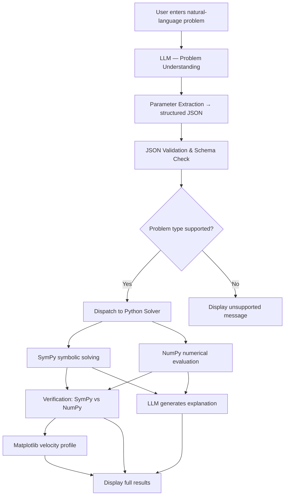

# Methodology — LLM-Powered Navier–Stokes Solver

## Pipeline Overview

## Step-by-Step Description

### 1. User Input
The user enters a free-form problem description in natural language. The input can be:
- A complete problem statement with all parameters
- A partial statement (missing parameters are flagged)
- A selection from pre-built example problems

### 2. Natural Language Understanding (LLM)
The LLM (OpenAI GPT or Demo Mode) receives:
- A carefully engineered **system prompt** establishing its role as a "Fluid Mechanics Problem Analysis Assistant"
- The user's problem text

The LLM is explicitly instructed:
- Not to perform arithmetic
- Not to invent parameters
- To list all assumptions explicitly
- To never claim to solve the general N-S problem

### 3. Parameter Extraction
The LLM returns a **structured JSON object** containing:
- `problem_type`: classification (poiseuille/couette/pipe/reynolds/unknown)
- `fluid`, `density`, `viscosity`: fluid properties
- `pressure_gradient`, `velocity`: flow quantities
- `dimensions.h`, `dimensions.R`: geometry
- `boundary_conditions`, `assumptions`: physical constraints
- `flags`: warnings for missing or inconsistent data

### 4. JSON Validation (`llm/parser.py`)
The parser:
- Strips markdown fences from the LLM response
- Extracts the JSON object
- Validates the schema
- Coerces numeric types
- Fills defaults for missing optional keys
- Appends validation flags

This step ensures the solver never receives malformed input from the LLM.

### 5. Problem Classification
The `problem_type` field routes to the correct solver:

| Type | Solver function |
|------|-----------------|
| `poiseuille` | `solve_plane_poiseuille()` |
| `couette` | `solve_couette()` |
| `pipe` | `solve_pipe_flow()` |
| `reynolds` | `compute_reynolds()` |

### 6. Assumption Identification
The LLM lists all applicable assumptions in the JSON. The solver also maintains its own assumption list per problem type:
- Steady flow (∂/∂t = 0)
- Incompressible (ρ = const)
- Newtonian fluid
- Fully developed flow
- No-slip boundary conditions
- etc.

These are displayed prominently so the user understands the validity domain.

### 7. Symbolic Solving (`solver/equations.py`)
SymPy solves the simplified ODE:
- Defines the ODE symbolically (e.g., `mu * u(y).diff(y,2) = dp_dx`)
- Uses `sp.dsolve()` to find the general solution
- Applies boundary conditions algebraically with `sp.solve()`
- Returns the particular solution as a SymPy expression and LaTeX string

### 8. Numerical Solving (`solver/analytical.py`, `solver/numerical.py`)
NumPy computes:
- Velocity profile array over the full domain (100 points)
- Maximum velocity, average velocity
- Volumetric flow rate (via `np.trapz()`)
- Reynolds number
- Wall shear stress

These deterministic calculations are completely independent of the LLM.

### 9. Independent Verification (`solver/validation.py`)
At a reference point (e.g., y = h/2 for plate flows, r = R/2 for pipe):
1. SymPy evaluates the symbolic expression numerically
2. NumPy reads the corresponding array value
3. Relative error is computed: `|a - b| / max(|a|, |b|, ε)`
4. Result is PASS if error < 1×10⁻⁶

### 10. Visualization (`visualization/plots.py`)
Matplotlib generates:
- **Plate flows**: horizontal profile u(y) vs y, with filled area and maximum marker
- **Pipe flow**: left panel u(r), right panel 2D colormap of cross-section
- **Reynolds**: horizontal gauge bar with regime regions and computed Re marker

All plots use a dark theme consistent with the Streamlit UI.

### 11. LLM Explanation
The LLM receives:
- The original problem text
- The extracted parameters
- The numerical results (from Python — not from itself)
- A prompt asking for physical interpretation

The LLM explains:
- The physical setup
- How N-S simplifies
- What the numbers mean physically
- Engineering significance
- Validity conditions

The LLM is explicitly told **not to re-derive or recalculate** — only to explain what the Python engine computed.

---

## Key Design Decisions

### Why not let the LLM calculate?
LLMs can make arithmetic errors, especially with floating-point calculations and symbolic integration. By delegating all calculation to NumPy/SymPy:
- Results are deterministic and reproducible
- Numerical verification is meaningful
- The LLM's role is constrained to what it does well: language understanding and explanation

### Why structured JSON output?
Unstructured LLM output is unpredictable. Forcing JSON:
- Makes the LLM commit to specific values
- Enables schema validation
- Separates LLM uncertainty from mathematical certainty
- Allows the parser to catch and flag errors before they reach the solver

### Why SymPy AND NumPy?
- SymPy provides **exact** symbolic expressions — the "ground truth" for verification
- NumPy provides **fast** numerical arrays — needed for plotting and integration
- Their agreement at a test point constitutes independent verification
